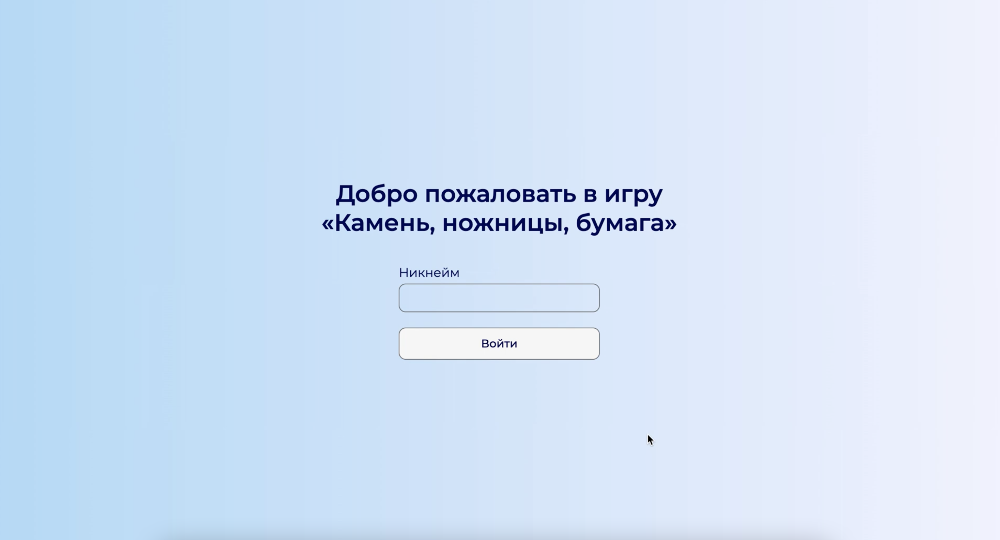
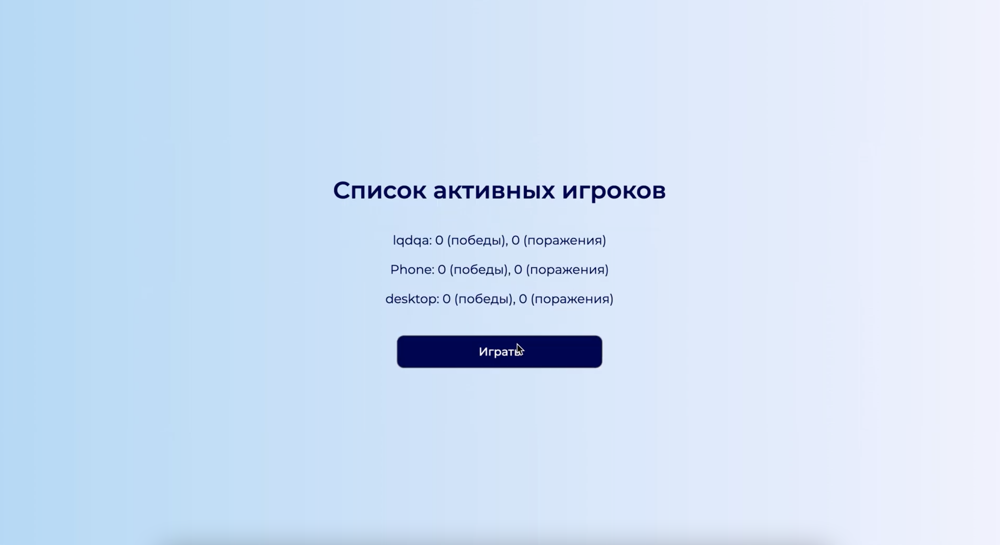
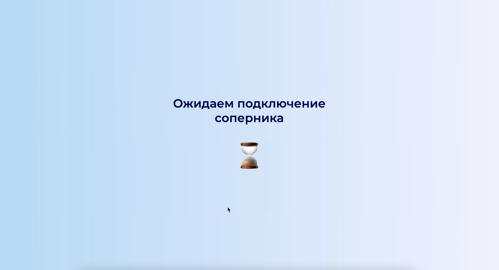
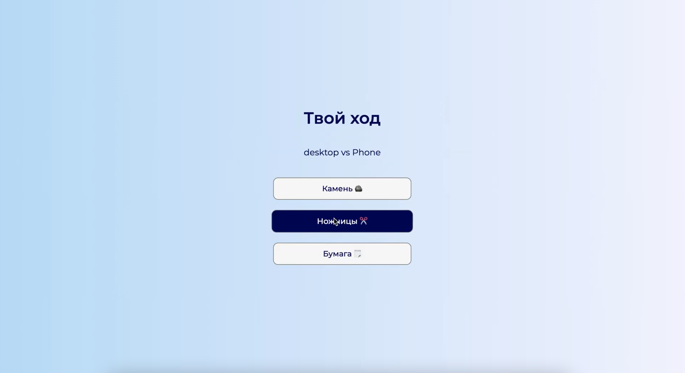
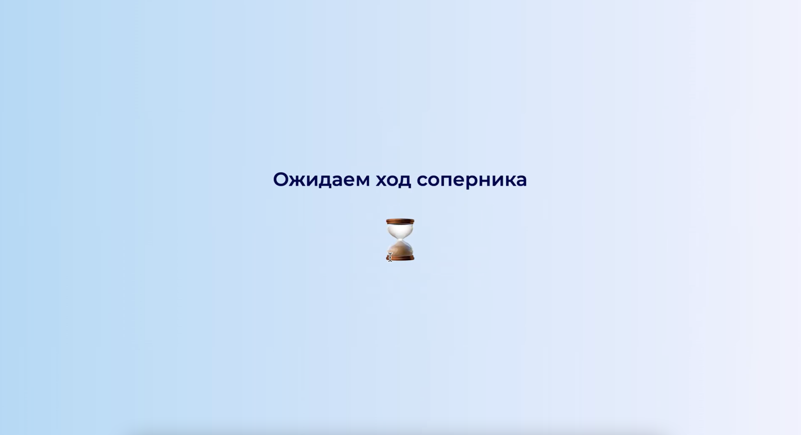
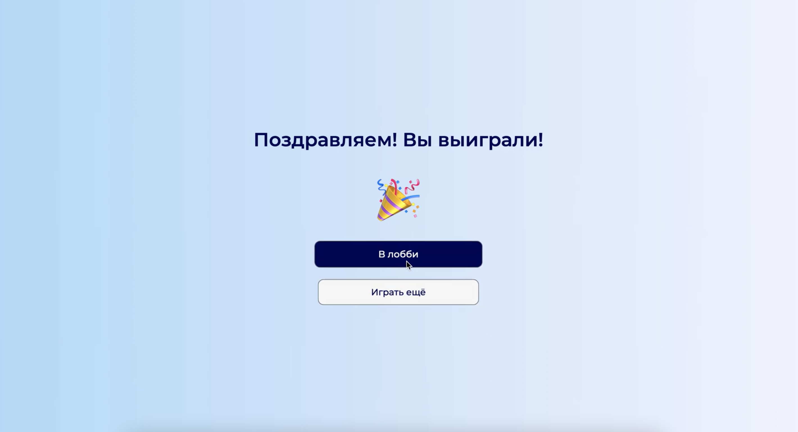
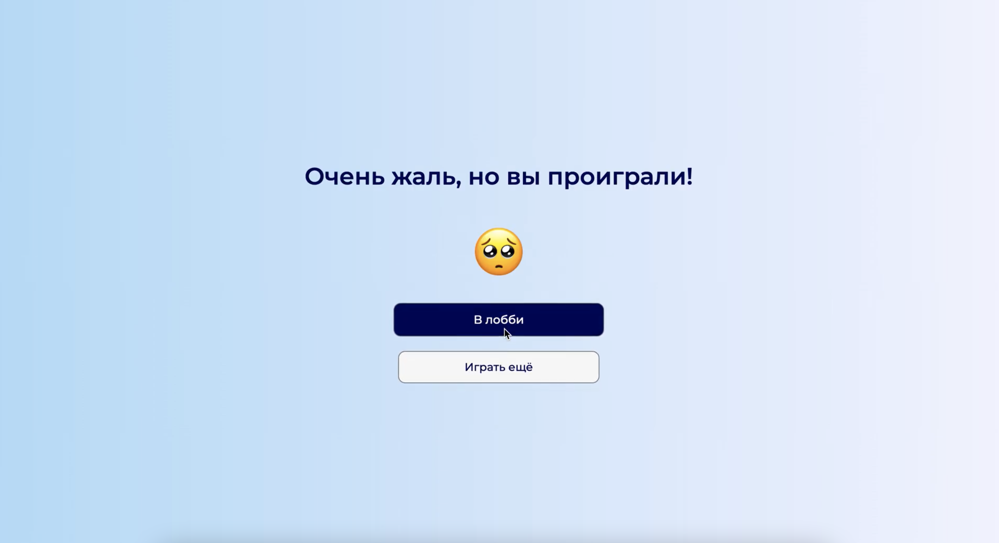

#### _English version_

<h1 align="center">Game «Rock-Paper-Scissors»</h1>
<h2 align="center">

## Description

The game was implemented from scratch in VanillaJS (JavaScript) according to my design. It contains a login form, several waiting screens, a game screen with 3 move options, and a "Lobby" screen with the results of all players.

## How to play

- Enter your username
- Once in the lobby, click on the "Play" button
- Wait until the opponent connects to you
- Make your move

Regardless of the result of the game, you can play again or return to the lobby.

## About the project

- Designed by me
- To communicate with the backend I use AJAX requests (XMLHttpRequest and GET requests)
- Each user receives a token after he enters his login and presses the "Login" button
- The lobby screen updates its content once per second according to the data received from the backend
- Waiting screens update their contents every half a second

#### Login screen

  

#### The lobby screen

  

#### Screen waiting for an opponent to connect

  

#### Game screen

  

#### Screen waiting for the opponent's move

  

#### Game result screen (win)

  

#### Game result screen (losing)

  

## Available Scripts

Since the project consists of a set of static files, the application works with the `npx http-server` command.

Open [http://localhost:8080](http://localhost:8080) to view it in a browser.
 
 

#### _Русская версия_

<h1 align="center">Игра «Кмень, ножницы, бумага»</h1>
<h2 align="center">

## Описание

Игра была реализована с нуля на VanillaJS (JavaScript) по моему дизайну. Она содержит форму для ввода логина, несколько экранов ожидания, игровой экран с 3 вариантами хода и «Лобби» - экран с результатами всех игроков.

## Как играть

- Введите свой логин
- Попадая в лобби, нажмите на кнопку «Играть»
- Подождите пока соперник подключится к вам
- Сделайте свой ход

Вне зависимости от результата игры вы можете сыграть ещё раз или вернуться в лобби.

## О проекте

- Дизайн был разработан мной
- Для связи с бэкендом использую AJAX-запросы (XMLHttpRequest и GET-запросы)
- Каждый пользователь получает токен после того, как введет свой логин и нажмет кнопку «Войти»
- Экран лобби раз в секунду обновляет свое содержимое в соответствии с полученными с бэкенда данными
- Экраны ожидания раз в пол секунды обновляют свое содержимое

#### Экран входа

  

#### Экран «Лобби»

  

#### Экран ожидания подключения соперника

  

#### Экран хода

  

#### Экран ожидания хода соперника

  

#### Экран результата игры (победа)

  

#### Экран результата игры (поражение)

  

## Как запустить

Так как проект состоит из набора статических файлов, то приложение работает с помощью команды `npx http-server`.

Откройте [http://localhost:8080](http://localhost:8080), чтобы посмотреть его в браузере.
 
 
